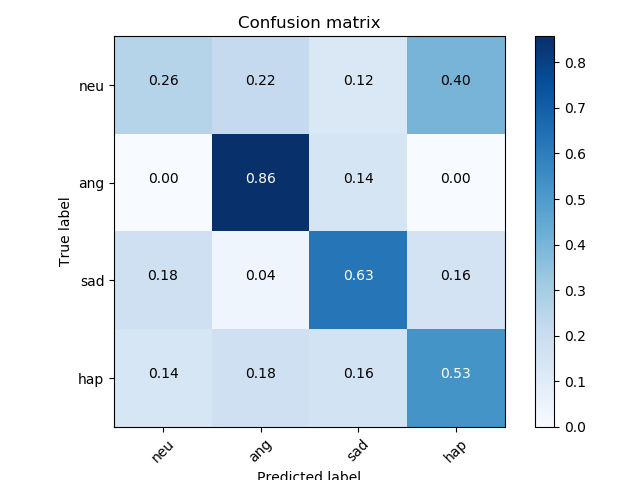
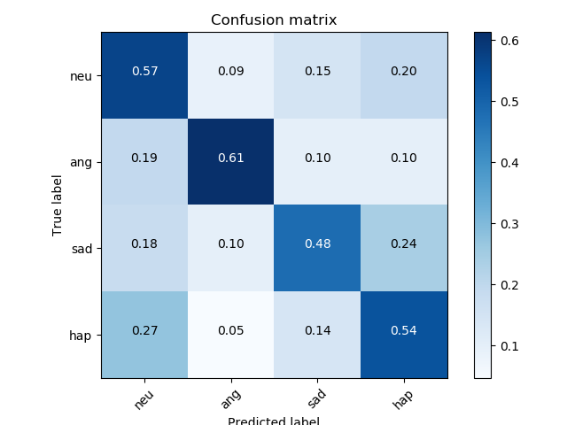

# SER (Speech Emotion Recognition) example using OpenSMILE and Bert Embeddings features

### Description

This example code is a speech emotion recognition using OpenSMILE and Bert Embeddings features.

### Dependencies
- python 3.6
- chainer 3.4

In addition, please add the project folder to PYTHONPATH and `conca install` the following packages:
- `matplotlib`
- `wave, python_speech_features`
- `pickle, bz2`

### Usage ###

***Data***

  - Downlod [IEMOCAP Datasets](https://sail.usc.edu/iemocap/release_form.php) and put them in `datasets/IEMOCAP_full_release`.

***Run and Evaluate***

- Training for OpenSMILE features

```
python train_iemocap-single.py --cw sum --gpu 0 --batchsize 100 --epoch 300 --layer 4 --unit 1000 --dropout 0.4 --weightdecay 0.0050 --optim adam \
--train datasets/iemocap/smile/emotion/train.txt \
--valid datasets/iemocap/smile/emotion/test.txt \
--out results/iemocap-emotion-mlp-384_u1000_b100_e300_d040_adam_wd0050 2>&1 \
| tee results/iemocap-emotion-mlp-384_u1000_b100_e300_d040_adam_wd0050.log
```

- Training for Bert Embeddings features
```
python train_iemocap-single.py --cw sum --gpu 0 --batchsize 100 --epoch 300 --layer 4 --unit 1000 --dropout 0.4 --weightdecay 0.0050 --optim adam \
--train datasets/iemocap/bert/train-sentence.txt \
--valid datasets/iemocap/bert/test-sentence.txt \
--out results/iemocap-bert-mlp-768_u1000_b100_e300_d040_adam_wd0050 2>&1 \
| tee results/iemocap-bert-mlp-768_u1000_b010_e300_d040_adam_wd0050.log
```

- Training for Fusion features (OpenSMile and Bert Embeddings)
```
python train_iemocap-fusion.py --cw sum --gpu 0 --batchsize 100 --epoch 300 --layer 4 --unit 1000 --dropout 0.4 --weightdecay 0.0010 --optim adam \
--train datasets/iemocap/fusion/train-sentence.txt \
--valid datasets/iemocap/fusion/test-sentence.txt \
--out results/iemocap-fusion-mlp-1152_u1000_b100_e300_d040_adam_wd0010 2>&1 \
| tee results/iemocap-fusion-mlp-1152_u1000_b100_e300_d040_adam_wd0010.log
```

***Output***


 
|OpenSMILE|Bert Embeddings|Fusion (OpenSMILE + Bert)|
|---|---|---|
||
||